# IoT-Based Smart Agriculture System — Node-RED Flow

## **Project Overview**
An **automated smart agriculture system** that uses **LoRa Radio** **LoRaWAN**, **MQTT**, **Telegram**, **InfluxDB**, and **weather forecasting** to **intelligently control irrigation**, **detect motion**, and **log data** for analysis and visualization — **all running on Raspberry Pi 4**!

---

## **System Integrations at a Glance**
| Component             | Purpose                                                |
|----------------------|--------------------------------------------------------|
| **LoRa Devices**      | Wireless sensors (light, motion, moisture) + relay     |
| **TTN (LoRaWAN)**     | Gateway for device data uplink & command downlink      |
| **MQTT Broker**       | Secure message exchange (TTN MQTT over TLS)            |
| **Node-RED**          | Central brain for automation and logic flow            |
| **Telegram Bot**      | Real-time user alerts (motion, relay status)           |
| **InfluxDB**          | Time-series database for sensor data & analytics      |
| **NEA Weather API**   | Fetch 2-hour rain forecast to optimize irrigation     |

---

## **Real-Time Sensor Data Flow**

### **LoRa Device 1** — Light + Motion (PIR) Sensor
- Every **10 seconds**, the **LoRa node (end device)** transmits **sensor data** via **LoRa radio** to a **LoRaWAN Gateway**, which then forwards the data using the **LoRaWAN protocol** to **The Things Network (TTN) network server**.
-  Node-RED **receives data every 10 seconds** via MQTT from **TTN network server**.
-  **Node-RED extracts**:
      - **Light intensity (lux)**
      - **PIR motion status (0/1)**
  -  **Triggers Telegram alert** when **motion is detected** 🚨.
  -  **Stores data in InfluxDB** for long-term analysis and dashboards.

---

### **LoRa Device 2** — Soil Moisture + Relay (Water Pump)
- Every **10 seconds**, the **LoRa node (end device)** transmits **sensor data** via **LoRa radio** to a **LoRaWAN Gateway**, which then forwards the data using the **LoRaWAN protocol** to **The Things Network (TTN) network server**.
-  Node-RED **receives data every 10 seconds** via MQTT from **TTN network server**.
-  **Node-RED analyzes moisture level**:
      - **If dry**: Check **NEA 2-hour forecast** in Punggol:
        - 🌧️ **Rain expected** → **Do NOT activate pump** (save water).
        - ☀️ **No rain** → **Activate water pump** (send relay ON command + Telegram alert 🚰).
      - **If wet**: **Deactivate pump** (send relay OFF command + Telegram alert 🚱).
    -  **Stores moisture and relay state in InfluxDB** for monitoring and optimization.
- **NEA API**:
    - **2-hour nowcast**: Offers **highly localized, accurate, near-term weather predictions** useful for **irrigation**
  - 🌐 [2-hour Weather Forecast API](https://data.gov.sg/datasets?query=weather&page=1&resultId=d_3f9e064e25005b0e42969944ccaf2e7a&sidebar=false)
---

## **Enhanced Automation Functions**

To take our smart agriculture system to the next level, we’ve built in **advanced functions** that ensure system reliability, timely alerts, and smart cost management. These functions are designed to monitor sensor communications and calculate water usage costs dynamically.

### **Lux & PIR Watchdog Timer Function**
- **Purpose:**  
  Ensures that the Lux & PIR sensor node is consistently sending data.  
- **How It Works:**  
  - Every time an uplink message is received from the Lux & PIR sensor, any existing timer is cleared and a fresh 40-second timer is started.
  - **If no message is received within 40 seconds:**  
    A Telegram alert is triggered with an attention-grabbing message (e.g., "🚨⚠️ Alert: No uplink message received from Lux & PIR Sensor for more than 40 seconds! ⏰").
- **Impact:**  
  This proactive monitoring guarantees that communication issues are identified immediately, so you’re always in the loop.

### **Moisture Sensor Watchdog Timer Function**
- **Purpose:**  
  Monitors the Moisture Sensor for regular data transmission to ensure sensor reliability.
- **How It Works:**  
  - Every incoming moisture sensor message resets a 40-second countdown timer.
  - **If the Moisture Sensor falls silent for 40 seconds:**  
    A Telegram alert is sent (complete with emoji flair) to notify you of the communication lapse.
- **Impact:**  
  By keeping a vigilant check on sensor activity, this function helps maintain system integrity and prevents unnoticed downtime.

### **Calculate Water Cost Function**
- **Purpose:**  
  Provides real-time insights into irrigation costs, enabling you to manage water resources more efficiently.
- **How It Works:**  
  - **Relay ON (Irrigation Start):**  
    When the water pump is activated (detected by a relay ON command "AQ=="), the function records the timestamp.
  - **Relay OFF (Irrigation End):**  
    When the pump is deactivated (relay OFF command "AA=="), the function calculates:
    - **Duration:** The total time (in minutes) the pump was active.
    - **Water Volume:** Using an assumed flow rate of 0.1 m³/min.
    - **Water Cost:** Multiplying the water volume by a fixed tariff of SGD $1.21/m³.
  - The calculated water cost and irrigation duration are then logged to InfluxDB for cost analysis.
- **Impact:**  
  This smart calculation helps track water usage, reducing wastage and keeping operational costs in check—a critical feature for sustainable agriculture.

---

## **Smart Automation Logic — End-to-End Flow**

1. **Soil moisture low** ➡️ **Check weather forecast**:
   - **Rain coming**?  **Skip irrigation**, conserve water.
   - **No rain**?  **Irrigate field**, turn pump ON.
2. **Soil moisture high** ➡️ **Turn pump OFF**, prevent overwatering.
3. **Motion detected** ➡️ **Instant Telegram alert**, possible intruder or wildlife.
4. **Every decision and sensor data** ➡️ **Logged to InfluxDB**, visualized in real-time dashboards.

---

## **Real-Time Alerts & Actions**
| Scenario                           | System Response                                    |
|------------------------------------|---------------------------------------------------|
| **PIR Motion Detected**            | "🚨 PIR Motion Detected Object!"                  |
| **Soil Dry, No Rain Forecasted**   | "Pump Relay On 🚰" (relay activated)              |
| **Soil Wet / Rain Forecasted**      | "Pump Relay Off 🚱" (relay deactivated)           |
| **Relay Status Change**             | Telegram update + InfluxDB log                    |
| **Sensor Inactivity (Watchdog)**    | Timely Telegram alerts to flag communication gaps |

---

## **Data Analytics & Visualization**
- **InfluxDB** dashboards for:
  - **Light & motion patterns** (security and sunlight analysis)
  - **Soil moisture trends** (irrigation optimization)
  - **Pump relay activity** (water usage tracking)
  - **Weather forecast logs** (historical analysis)
  - **Water cost** (historical analysis)  
- **Externally accessible** via **Ngrok tunnel** for remote monitoring:
  - 🌐 [Smart Agriculture Dashboard](https://literate-rationally-bulldog.ngrok-free.app/orgs/ffdd4765241aec37/dashboards/0e8927d7116cd000/)

---

## **Key Technical Highlights**
- **LoRaWAN downlink** control of **remote water pump** via MQTT.
- **Base64 decoding** of sensor payloads for accurate data extraction.
- **Dynamic Conditional Logic:** Automation based on live weather forecasts.
- **Full end-to-end automation** with **Telegram alerts** and **data logging** — no manual intervention required!
- **Flow-based programming** using **Node-RED** for clear visualization and rapid iteration.
- **Advanced Watchdog Timers:**  
  - **Lux & PIR & Moisture Sensor Watchdogs:** Ensure continuous communication with proactive alerts.
- **Cost Analytics:**  
  - **Calculate Water Cost Function:** Monitors irrigation duration, water volume, and cost to optimize resource usage.
  
---

## **The Value & Impact Of This Outcome**
- **Smart water management**: Avoids unnecessary irrigation — **saves water, reduces costs**.
- **Real-time security**: Motion detection for wildlife or intruder alerts.
- **Fully autonomous**: No need for human monitoring — **self-deciding system**.
- **Data-driven optimization**: Long-term storage and analytics for improving farm management strategies.
- **Edge computing**: **Runs on Raspberry Pi** — no cloud dependency, **cost-effective** and **private**.

---

## **Conclusion**
A **cutting-edge, real-world IoT solution** blending **environmental intelligence**, **automation**, and **real-time communication**, making agriculture **smarter, efficient, and sustainable**.

It’s designed not only to optimize agricultural practices but to empower you with **actionable insights** for a **sustainable future**. Step into the future of **smart farming**—where **every drop counts** and every alert drives efficiency!

```plantuml
@startuml
title Smart Agriculture System — Data Processing & Analytics Flow

actor Farmer
participant "LoRa Device 1\n(Lux & PIR)" as Device1
participant "LoRa Device 2\n(Moisture & Relay)" as Device2
participant "TTN\n(MQTT Broker)\n(Uses TLS)" as TTN
participant "Node-RED\n(Data Processing Engine)" as NodeRED
participant "NEA Weather API" as NEA
participant "InfluxDB" as Influx
participant "Telegram Bot" as Telegram

== Sensor Data Uplink ==
Device1 -> TTN : Send base64 payload (every 10 sec)
Device2 -> TTN : Send base64 payload (every 10 sec)
TTN -> NodeRED : Forward secure MQTT message

== Payload Decoding & Extraction ==
NodeRED -> NodeRED : Decode base64 payload
NodeRED -> NodeRED : Extract sensor values\n• Lux, PIR (Device1)\n• Moisture (Device2)
NodeRED -> NodeRED : Retrieve metadata (RSSI, SNR)
NodeRED -> NodeRED : Validate payload structure

== Lux & PIR Sensor Flow ==
NodeRED -> Influx : Store sensor data (lux, PIR, metadata)\n[Tags: Device ID, Location, Sensor Type]
alt Motion Detected (PIR == 1)
    NodeRED -> Telegram : Send motion alert
end
NodeRED -> NodeRED : Reset Lux & PIR watchdog timer
alt No Data Received (40 sec)
    NodeRED -> Telegram : Send watchdog alert for Lux & PIR Sensor
end

== Moisture & Relay Flow ==
NodeRED -> NodeRED : Check moisture value (< 300?)
alt Moisture < Threshold
    NodeRED -> NEA : Request 2-hour weather forecast
    NEA --> NodeRED : Return forecast data
    NodeRED -> Influx : Log forecast data
    alt Forecast indicates Rain
         NodeRED -> NodeRED : Decide: Relay OFF
    else No Rain
         NodeRED -> NodeRED : Decide: Relay ON
    end
else Moisture ≥ Threshold
    NodeRED -> NodeRED : Decide: Relay OFF
end
NodeRED -> Influx : Store moisture data & relay command
NodeRED -> Telegram : Notify relay status change
NodeRED -> NodeRED : Reset Moisture watchdog timer
alt No Data Received (40 sec)
    NodeRED -> Telegram : Send watchdog alert for Moisture Sensor
end

== Relay Command Handling ==
alt Relay ON Command
    NodeRED -> NodeRED : Record irrigation start time
else Relay OFF Command
    NodeRED -> NodeRED : Calculate irrigation duration = Now - Start Time
    NodeRED -> NodeRED : Compute water volume (duration * 0.1 m³/min)
    NodeRED -> NodeRED : Calculate water cost (volume * SGD 3.24/m³)
    NodeRED -> Influx : Log irrigation event (duration, cost)
end

@enduml

```

